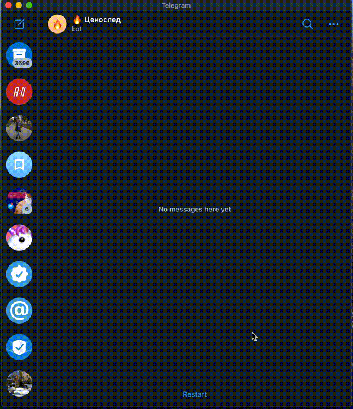

# Pricewatcher
Pricewatcher is a telegram bot who detect price change. Tell about at least one link to [@apm_pricewatcher_bot](https://t.me/apm_pricewatcher_bot) and wait a little bit.

## Available parsers
- pumamoldova.md
- origin.md
- myskin.md
- moonglow.md
- inglot.md
- elefant.md
- sephora.com
- cosmeticshop.md
- makeup.md
- ovico.md
- shop.vizaje-nica.com
- cultbeauty.co.uk
- darwin.md
- sonycenter.md
- alcomarket.md
- pegas.md

## Todos
- [x] Realize parser
- [x] Realize telegram integration
- [x] Run bot [@apm_pricewatcher_bot](https://t.me/apm_pricewatcher_bot)
- [x] Give a way to add parsers
- [ ] Run rspec, rubocop and brakeman in CircleCI
- [ ] Schedule deletion of too old links
- [ ] Collect events and create read models
- [ ] Schedule sending statistics in the regular basis 

## Contact us 
<table>
  <tr>
    <th>Channel</th>
    <th>Author</th>
  </tr>
  <tr>
    <td></td>
    <td></td>
  </tr>
</table>

